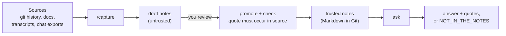

# second-brain

**Ask what a project decided, why, and what changed. Get an answer with the verified quote
behind it, or "not in the notes".**

> Status: **v0.1 prototype.** The verification core and the question-answering work today.
> Input from video, Slack links, screen recordings, a web page and an MCP server do **not** exist
> yet. [docs/STATUS.md](docs/STATUS.md) says exactly what works; [docs/ROADMAP.md](docs/ROADMAP.md)
> says what comes next. It has **not** been benchmarked against Claude Code alone.

## The problem

The reason for a decision lives where nobody looks again: a commit body, an old chat, a meeting.
Months later nobody remembers it, and an AI asked about it either cannot see it or answers
fluently and wrongly.

## What this does about it

1. **Capture.** Claude Code reads a source (a git repo, a transcript, a chat saved as text) and
   writes small Markdown **notes**: one fact each, with the exact quote it came from.
2. **Verify.** A program checks that every quote really occurs in its source, with a plain string
   comparison. A note whose quote is not found is rejected. You review drafts before they count.
3. **Ask.** A model running **on your machine** answers from the verified notes only, and prints
   the quote, source and "still true / no longer true" for every claim. If the notes do not
   cover the question it says so.



## See it work (this project explains itself)

`examples/brain` is this project's own decision log turned into 14 notes, each quote checked
against [docs/DECISIONS.md](docs/DECISIONS.md). Real output:

```
$ brain check
14 notes (10 current, 4 superseded): every quote verified against its source

$ brain ask "Why is there no Spring Boot in version 0.1?"
Version 0.1 uses plain Java instead of Spring Boot because the project initially aimed for a
CLI tool that does not require a web framework [1]. The earlier plan to use Spring Boot with
LangChain4j was replaced by plain Java on the same day [2].

Sources (printed from the notes, not by the model):
  [1] second-brain/No Spring in v0.1, LangChain4j core only — current, 2026-10-01 → now
      "A local CLI and MCP tool does not need a web framework."   file:docs/DECISIONS.md
  [2] second-brain/Spring Boot plus LangChain4j plan dropped — NO LONGER TRUE, 2026-10-01 → 2026-10-01
      "Supersedes: "Spring Boot + LangChain4j" (same day, earlier)"   file:docs/DECISIONS.md

$ brain ask "Which cloud provider does it run on in production?"
NOT_IN_THE_NOTES
(The notes do not answer this. That is a gap, not a guess.)
```

The last answer is the point: it declines instead of inventing one. Note the first answer is
slightly loose ("initially aimed"); the quotes beside it are what let you catch that. Answers
from a small local model are not perfect.

## Try it

Needs **JDK 27** and a local OpenAI-compatible model server (for example
[LM Studio](https://lmstudio.ai) on `:1234` with `qwen/qwen3-14b` and
`text-embedding-nomic-embed-text-v1.5` loaded).

```bash
git clone https://github.com/hhovhann/second-brain && cd second-brain
export JAVA_HOME=/path/to/jdk-27         # or: sdk env  (see .sdkmanrc)
./gradlew installDist
B=build/install/second-brain/bin/second-brain
export BRAIN_DIR=examples/brain          # the bundled self-demo

$B doctor                                # Java, model server
$B check                                 # no model needed
$B ask "Why did you drop the graph database?"
$B ask "Why is there no Spring Boot in version 0.1?"
$B eval examples/self-eval.yaml second-brain
```

Variables: `BRAIN_DIR` (notes folder, default `brain`), `BRAIN_LLM_BASE_URL`,
`BRAIN_CHAT_MODEL`, `BRAIN_EMBEDDING_MODEL`. `ask --project p` limits to one project;
`ask --as-of 2026-09-20` answers as of a date.

## Use it on your own project

1. Open Claude Code in this folder (it reads [CLAUDE.md](CLAUDE.md) and the commands in
   `.claude/commands/`).
2. `/capture ../my-project my-project` writes drafts to `brain/_draft/my-project/`.
3. Read the drafts. `brain check --drafts`, then `brain promote my-project`.
4. `/ask why did we remove X?` or `brain ask --project my-project "..."`.

Keep your real notes private: `brain/` is git-ignored here. Put them in your own private
repository or `BRAIN_DIR=brain-private`.

## What it takes as input today

| Input | Today |
|---|---|
| Git repository (history, README, CHANGELOG, docs) | Yes |
| Any text or Markdown file, a saved meeting transcript, a chat pasted into a file | Yes |
| Slack link, video URL, screen recording | **No.** Get the text out first; a transcription step is planned (v0.3) |

Details and examples: [docs/USE-CASES.md](docs/USE-CASES.md).

## Why not just ask Claude Code or Codex

For one repo and a question the code answers, you often should. This project tries to add what
they do not give you: memory between sessions, one brain across projects, knowledge from
meetings and chats, a verified quote for every claim, "what was true on this date", and
answers that run locally. **Whether it actually answers better is not yet measured**; the
benchmark and its fixed pass/fail rule are in [docs/BENCHMARK.md](docs/BENCHMARK.md).

## Documents

| | |
|---|---|
| [docs/ARCHITECTURE.md](docs/ARCHITECTURE.md) | components, the note format, how `ask` works, what is not guaranteed |
| [docs/USE-CASES.md](docs/USE-CASES.md) | the problem, real examples, what inputs work |
| [docs/ROADMAP.md](docs/ROADMAP.md) | releases v0.2 to v0.5 and what could be better |
| [docs/STATUS.md](docs/STATUS.md) | what works, known problems, what is not built |
| [docs/DECISIONS.md](docs/DECISIONS.md) | why it is built this way, with superseded decisions kept |
| [docs/SECURITY.md](docs/SECURITY.md) | threat model: poisoning, injection, exfiltration |
| [docs/BENCHMARK.md](docs/BENCHMARK.md) | the go/no-go test and its decision rule |

## Layout

```
src/main/java/com/hhovhann/brain/   Note, Check, Promote, Ask, EvalRun, Models, Doctor, Brain (CLI)
src/test/java/                      unit tests (no model needed)
examples/brain/second-brain/        14 verified notes about this project
examples/self-eval.yaml             5 gold questions, and the question-file format
.claude/commands/                   /capture  /ask  /improve
```

## Contributing

Ask for a change by opening an issue, or run `/improve` in Claude Code: it takes the top open
item of the roadmap, writes a failing case first, fixes it, and records the decision. A decision
that replaces an earlier one says so in `docs/DECISIONS.md`; nothing is deleted.

License: MIT.
