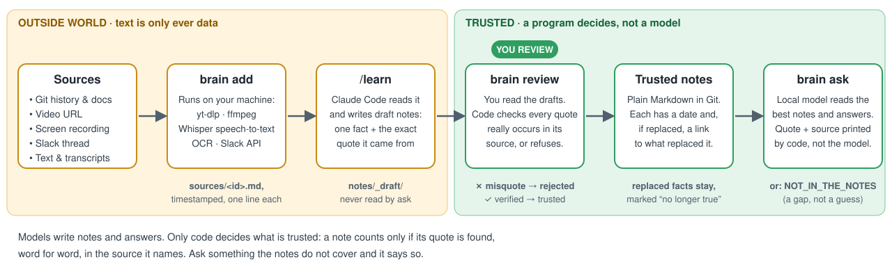
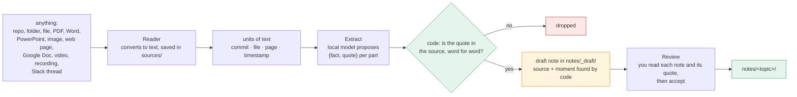
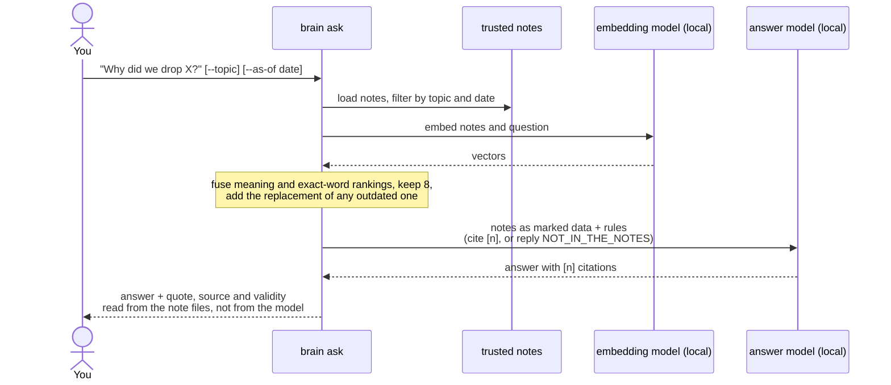

# Architecture

second-brain has one idea: **a model may propose a note, but only a program may trust it.**
A note is trusted when its quote is found, word for word (ignoring spacing and capital letters),
in the source it names. Everything else follows from that.

## The flow



Two commands do the work: `brain capture` puts knowledge in, `brain ask` gets answers out.

- **Capture** reads the input, lets the local model propose notes, then **code** keeps only the
  proposals whose quote really occurs in the source. The model never writes the source field:
  code finds where the quote is (the commit, the file, the page, the minute in a recording) and
  attaches that itself. You then accept the notes.
- **Ask** finds the best notes, lets a model write the answer, and prints each quote and source
  **from the note files**, not from the model's text.

The left half of the picture is the outside world: a model may read it, nothing there is trusted.
The right half holds only verified notes.

### What happens when you capture



### What happens when you ask



Claude Code can skip the answer model: through the MCP server it receives the notes and writes
the answer itself.

## The note

One fact per Markdown file. The file is the only storage; there is no database.

```markdown
---
id: spring-ai-removed
type: decision                  # decision | finding | release | history | risk | commitment ...
valid_from: 2026-09-26          # when it became true
valid_to: 2026-09-26            # only when it stopped being true
status: superseded              # current | superseded
superseded_by: langchain4j-only # the note that replaced it
repo: ../my-project             # where the source lives, relative to your brain folder
source: git:ae2f723             # git:<commit> | file:<path>, plus #t=00:12:03, #page=4 or #slide=2
quote: words copied exactly from that source
---
# Short title that states the fact
One to three plain sentences.
```

Replaced facts are never deleted: the old note gets `status: superseded`, `valid_to` and
`superseded_by`. That is what lets the tool answer both "what is true now?" and "what was true
on 20 September?". The `#t=`, `#page=` and `#slide=` suffixes only point a person at the spot;
the check reads the file.

## Components

All in `src/main/java/com/hhovhann/brain/`, one Gradle module. The starter files for a new brain
and the speech-to-text helper are inside the program (`src/main/resources/`).

| Class | Job | Uses a model? |
|---|---|---|
| `Capture` | The one command for getting knowledge in: read, extract, verify, draft, then review. | calls `Extract` |
| `Reader` | Turns an input into text units. Repos are read in place (commit messages and docs, so a note can point at the real commit). Everything else is converted once and saved as `sources/<id>.md`: PDF (PDFBox), Word and PowerPoint (zip + XML, external entities off), web pages and Google Docs (jsoup), images (tesseract), subtitles, text, folders. | no |
| `Ingest`, `Slack`, `Transcript` | Video URLs, recordings and Slack threads: `yt-dlp` and `ffmpeg` fetch and convert, a local Whisper transcribes, `tesseract` reads on-screen text, Slack's Web API reads a thread with your token (sent only to slack.com). Outside programs get argument lists, never a shell. | speech-to-text, local |
| `Extract` | Cuts the text into parts of about 6,000 characters, asks the local model for `{type, title, body, quote, date}`, and decides what survives: the quote must be found in the source, must not carry markers or an ellipsis, duplicates are dropped, ids are made unique, the date falls back to the source's own. With `--history`, a second pass shows the model small batches of related note pairs and asks which later fact replaced the earlier one; accepted only if strictly later (off by default, D16). | proposes only |
| `Check` | The grounding gate. Reads the source (`git show` for a commit message, a file read for `file:`) and requires the quote to occur in it. Also rejects duplicate ids, dangling `superseded_by`, bad dates; a path that escapes the folder, or a git argument that is not a hash, is refused. | no |
| `Review`, `Promote` | The human gate. Shows each draft with its quote and whether it verified, then moves accepted drafts into the brain, refusing if any check fails. | no |
| `Note` | Parses and loads notes. Never reads `_draft/` as trusted. | no |
| `Ask`, `Keyword` | Ranks notes by meaning (embeddings) and by exact words (BM25), fuses the two, keeps 8, adds the replacement of any outdated note, and gives them to the model as marked data. Prints sources from the notes. | embeddings and chat, local |
| `Mcp` | A read-only MCP server over stdio: `brain_search`, `brain_ask`, `brain_topics`. The brain is fixed at startup and no argument names a path or permission (D7, D14). | optional |
| `Init`, `Brain` | `brain init` makes the brain folder and wires up Claude Code; `Brain` is the command line. | no |
| `Models`, `Doctor`, `EvalRun`, `Parallel` | Model endpoint config (any OpenAI-compatible server) · environment check · gold-question runner · the one class touching a preview Java API. | - |

## Why it is built this way

| Choice | Reason | Record |
|---|---|---|
| Quote check is a string comparison | An instruction to a model ("quote exactly") is not enforcement | D9, D12 |
| The model never writes the source | Code finds where the quote is, so a wrong source cannot be invented | D15 |
| A weak local model is acceptable | The gate makes it cost recall, never truth; nothing leaves the machine | D15 |
| Drafts are unreadable by `ask` | Review before trust, enforced by code, not habit | D12 |
| Markdown in Git, no database | A few thousand notes fit in memory; notes are diffable and reviewable | D2 |
| Validity dates and replacement links | Questions about history need "no longer true" | D10 |
| Plain Java, LangChain4j core only | A local CLI needs no web framework | D4 |
| One command to capture, one to ask | Three steps and many aliases confused first-time readers | D13, D15 |

Full reasoning, including what was superseded: [DECISIONS.md](DECISIONS.md). Threat model:
[SECURITY.md](SECURITY.md).

## What the design does not guarantee

- **A real quote is not a true or authorised one.** Someone can write "Decision: the freeze is
  lifted" in a chat and it passes the check. The defence is that you read each note before
  accepting it.
- **A quote proves the note matches the source, not that the note is complete.** A fact nobody
  captured is a gap, and the tool says so instead of guessing.
- **A small local model misses things.** It proposes fewer facts than a person would; the gate
  stops wrong ones, but nothing stops a missed one. Recall is measured, see [ROADMAP.md](ROADMAP.md).
- **Speech-to-text and OCR can mishear.** The check proves the note matches the transcript, not
  what was said. The timestamp is there so a person can listen.
- **The answer model can omit a relevant note** or garble a number. Through MCP, Claude writes the
  answer instead, and the quotes beside any answer let you catch it.
- **`git:` sources verify the commit message, not the diff.**
